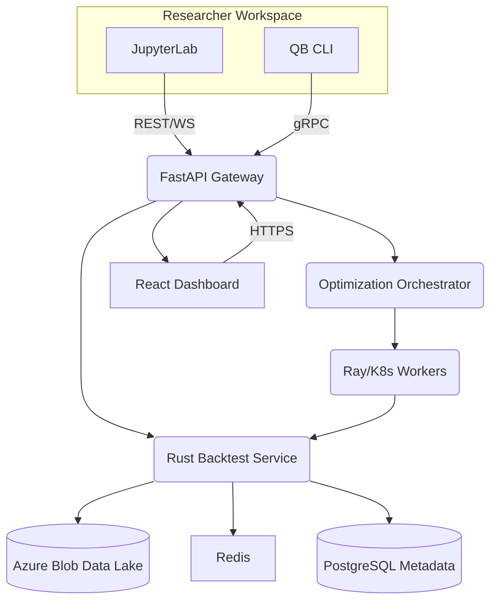
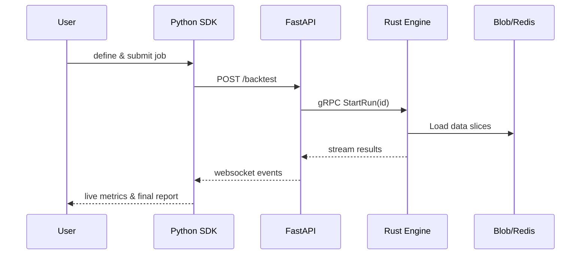

# Glowback - A Quant Backtest Platform – Architectural Blueprint

## Table of Contents
1. Core Mandate & User Profile
2. Architectural Pillars & Feature Requirements
   1. Data Ingestion & Management
   2. Strategy Development Environment
   3. Backtesting Engine
   4. Performance Analytics & Visualization
   5. Optimization & Robustness Testing
   6. Functional Local Validation UI
3. Technology Stack & Deployment
4. Constraints & Non-Goals
5. Security, Compliance & Observability
6. Scalability & Performance Goals
7. System-Level Diagrams
8. Roadmap & Future Work

---

## 1. Core Mandate & User Profile

| Aspect | Description |
|--------|-------------|
| **Primary Objective** | Develop, test & optimize **medium-frequency trading strategies** with high realism & low friction. |
| **Target Audience** | Sophisticated retail traders • Small quant hedge funds • Academic researchers • Students of quantitative finance |
| **Key Differentiator** | 1) **Ultra-realistic market simulation** (micro-structure aware) 2) **ML-ready interface** (scikit-learn / PyTorch) 3) **Built-in statistical robustness checks** |

---

## 2. Architectural Pillars & Feature Requirements

### 2.1  Data Ingestion & Management

| Requirement | Design Choice | Justification |
|-------------|---------------|---------------|
| **Sources** | • Local CSV / Parquet  • Alpaca Markets (live)  • Polygon.io (historical) | Covers free & premium pipelines; abstracts via Source Adapter pattern. |
| **Data Types** | Tick, 1-min OHLCV, fundamentals, alternative (sentiment, ESG) | Supports MFT strategies & future extensibility. |
| **Storage** | • Columnar **Parquet** stored in object storage (**Azure Blob Storage / ADLS Gen2**)  • **Apache Arrow** in-memory tables | Columnar compression & predicate pushdown; Arrow zero-copy sharing with Rust engine. |
| **Caching** | **Redis Cluster** for most-recent symbol shards | Millisecond latency for iterative research. |
| **Catalog / Metadata** | **DuckDB** for local analytics; **PostgreSQL** for shared envs | Lightweight yet SQL-rich; easy LAN → WAN migration. |
| **Versioning & Audit** | **Delta Lake** transaction log or **Apache Iceberg** table format | Time-travel queries, schema evolution, and reproducible backtests. |

Data Lake Layout (Delta-Lake-style): `abfs://backtest-data@{storage_account}.dfs.core.windows.net/{asset_class}/{frequency}/{symbol}/{year}.parquet`.

---

### 2.2  Strategy Development Environment

| Aspect | Design | Rationale |
|--------|--------|-----------|
| **Interface** | 1) **Python SDK** (`qb.Api`) with event-driven API similar to Backtrader  2) **JupyterLab plugin**  3) **Drag-and-drop UI** (Phase-2, mandatory deliverable) | Balances power users & low-code entrants; ensures a fully featured visual interface is shipped. |
| **Built-in Indicators** | TA-Lib wrappers, VectorBT functions | Leverages battle-tested libs. |
| **ML Integration** | `qb.DataFrame` ↔ scikit-learn/PyTorch tensors via Arrow | Zero-copy to GPU; seamless research loop. |
| **Multi-Asset Handling** | Strategy class receives per-asset events; portfolio context object manages cash & margin. | True portfolio-level logic. |

---

### 2.3  Backtesting Engine

| Component | Details |
|-----------|---------|
| **Core Logic** | **Event-driven simulator** in **Rust** (`no_std` where possible) using **Tokio** for async. |
| **Data Access** | Memory-maps Parquet via Arrow; lazy loads slices into columnar SIMD iterators. |
| **Execution Model** | • Market, limit, stop orders  • Configurable slippage (bps of spread or custom func)  • Fee matrix (fixed + per-share)  • Latency model (per symbol & venue) |
| **Asset Coverage** | v1: US Equities & Crypto (spot)  v2+: FX | Focus on high-liquidity assets first. |
| **Parallelism** | • **Ray**-backed distributed runs for optimization  • SIMD & Rayon inside Rust for single-run speed | Ensures sub-minute 10y/500-symbol goal. |
| **Determinism** | Reproducible seeds; results hash stored in metadata DB. |
| **Time-Zone Handling** | Internal engine uses UTC nanosecond timestamps; UI converts to user locale | Avoids daylight-saving anomalies & ensures consistent ordering. |

---

### 2.4  Performance Analytics & Visualization

| Feature | Implementation |
|---------|----------------|
| Metrics | Sharpe, Sortino, Calmar, CAGR, Max Drawdown, Volatility, Skew, Kurtosis, Win/Loss, Beta, Alpha. |
| Visualization | **React + Plotly** interactive dashboard (equity curve, heatmaps, rolling stats). |
| Reporting | One-click export to **PDF/HTML**; **nbconvert** for notebook runs. |
| Benchmarking | Built-in SPY & BTC indices; custom import supported. |

---

### 2.5  Optimization & Robustness Testing

| Capability | Tooling | Notes |
|------------|---------|-------|
| **Parameter Search** | Grid, Random, **Bayesian (Optuna)** | Optuna sampler plugin for hyper-opt. |
| **Walk-Forward Analysis** | Rolling window re-fit & out-of-sample test; visual zone chart. |
| **Monte Carlo** | Bootstrapped trade & path-wise simulations; 95% CVaR output. |
| **Distributed Runs** | Orchestrated by **Ray**; each worker container pulls data snapshot. |

---

### 2.6  Functional Local Validation UI (PoC Ready)

| Aspect | Design | Rationale |
|--------|--------|-----------|
| **Purpose** | Provide an immediately usable UI for running backtests, viewing results, and tweaking parameters **without any cloud dependencies**. | Lowers barrier to entry; enables offline experimentation and demo.
| **Tech Stack** | **Streamlit 1.35+** (Python) packaged with the `qb` SDK. | Streamlit offers declarative UI, zero-config launch (`streamlit run ui.py`).
| **Key Screens** | 1) **Data Loader** – select symbols, date range, resolution.  2) **Strategy Editor** – code pane with syntax highlighting + templates.  3) **Backtest Runner** – start/stop & live log panel.  4) **Results Dashboard** – equity curve, metrics table, trade list. | Covers full research loop.
| **Architecture** | Streamlit app imports `qb` engine via Python FFI; runs backtest in separate process; uses WebSocket to stream metrics to frontend widgets. | Keeps UI responsive; mirrors cloud flow.
| **Packaging** | `uv pip install quantbacktest[ui]` or `uv venv` for isolated env; `qb ui` CLI alias launches Streamlit server on `localhost:8501`. | Uses uv for fast, reproducible environment setup. |
| **Extensibility** | Widgets built as reusable components, allowing gradual migration to React dashboard. | Protects investment.

---

## 3. Technology Stack & Deployment

| Layer | Tech | Reason |
|-------|------|--------|
| **Core Engine** | **Rust** (+ Arrow + Parquet) | Speed, memory safety. |
| **API Layer** | **FastAPI (Python)** | Async, OpenAPI docs, easy Python interop. |
| **Worker Orchestration** | **Ray** on **Kubernetes** (Azure AKS) | Horizontal scalability for optimization. |
| **Metadata DB** | **PostgreSQL** (RDS) | ACID, rich SQL. |
| **Object Storage** | **Azure Blob Storage / Azurite** | Durable, cheap, S3-compatible APIs with ADLS features. |
| **Cache** | **Redis Cluster** | Sub-ms read path. |
| **Message Bus** | **NATS** | Lightweight, at-least-once event delivery. |
| **Frontend** | **React + TypeScript** with **Vite**; Auth via **Azure AD B2C**. |
| **CI/CD** | GitHub Actions → **ACR** images → Argo CD sync to **AKS**. |
| **Python Dependency Mgmt** | **uv** | Fast Rust-based replacement for pip & venv; deterministic installs. |
| **Container Runtime** | Docker (distroless images) | Security & size. |

---

## 4. Constraints & Non-Goals

1. **No live trading** in v1 (focus on research).
2. Options & Futures excluded until phase-3.
3. Sub-second backtest resolutions excluded (tick & 1-min suffice for MFT).
4. Entire system **open-source (MIT)**.
5. **Performance target:** Backtest 10y of daily data for 500 equities **< 60 s** on 8-core dev machine.
6. Budget-friendly: All critical services run on single-node k3d for local, scale-out on cloud.

---

## 5. Security, Compliance & Observability

| Domain | Measure |
|--------|---------|
| **Data Security** | Blob Storage Access Policies, **Azure Key Vault** encryption, Azure RBAC. |
| **Secrets** | **Azure Key Vault** injected via **Managed Identities**. |
| **Compliance** | GDPR (data deletion APIs); SOC2 ready controls. |
| **Observability** | **OpenTelemetry** traces; Grafana dashboards; Loki logs. |
| **Testing** | Unit (pytest, cargo test) • Property-based (proptest) • Integration & regression runs nightly. |

---

## 6. Scalability & Performance Goals

1. **Horizontal Scale:** Stateless API pods; workers auto-scale via KEDA on queue depth.
2. **Cold-start Latency:** Engine compiled to shared library & pre-warmed; dataset caching tier.
3. **Throughput:** 1M order events/s simulated on c6i.4xlarge benchmark.
4. **Storage Footprint:** ≤ 1 TB for 10y tick data of 1 k symbols using ZSTD-compressed Parquet.

---

## 7. System-Level Diagrams

### 7.1  High-Level Component Diagram

### 7.2  Backtest Data Flow

---

## 8. Roadmap & Future Work

| Phase | Timeline | Milestones |
|-------|----------|-----------|
| **0 – PoC** | Month 1-2 | Rust engine MVP • Parquet reader • CLI backtest • **Local Streamlit UI**. |
| **1 – Alpha** | Month 3-4 | FastAPI, Jupyter plugin, basic analytics, equities only. |
| **2 – Beta** | Month 5-7 | React dashboard, Ray optimization, crypto support, Docker deploy. |
| **3 – GA** | Month 8-10 | Security hardening, SOC2 prep, docs, community launch. |
| **4 – Extended** | 12 m+ | Live trading, options module, real-time risk engine. |

---

### Conclusion
This architecture delivers **speed**, **realism**, and **accessibility** while remaining modular for future expansion. Leveraging Rust for the critical path ensures extreme performance, while Python & React provide a friendly surface for quantitative researchers. Container-native deployment enables effortless scale from laptops to the cloud, fulfilling the mandate for a world-class quantitative backtesting platform. 