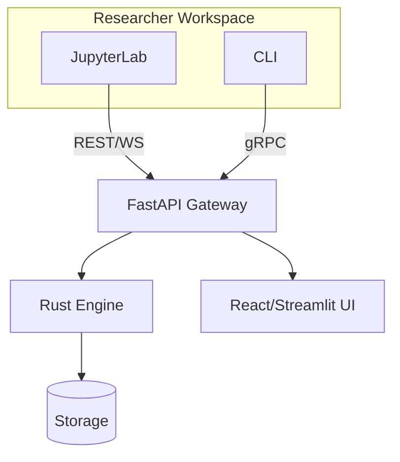

# Architecture

GlowBack is a Rust‑first backtesting platform with a Python SDK and local UI.

## Core Crates

- **gb-types**: core data structures, orders, portfolio, strategies
- **gb-data**: data ingestion, providers, SQLite catalog, Parquet storage/loader
- **gb-engine**: event‑driven backtesting engine and market simulation
- **gb-python**: PyO3 Python bindings

## Data Flow (high‑level)

1. Load data from providers into storage/catalog.
2. Configure a strategy and execution parameters.
3. Run the engine and stream results to UI/SDK.
4. Persist results for analysis and reporting.

## System Diagram

