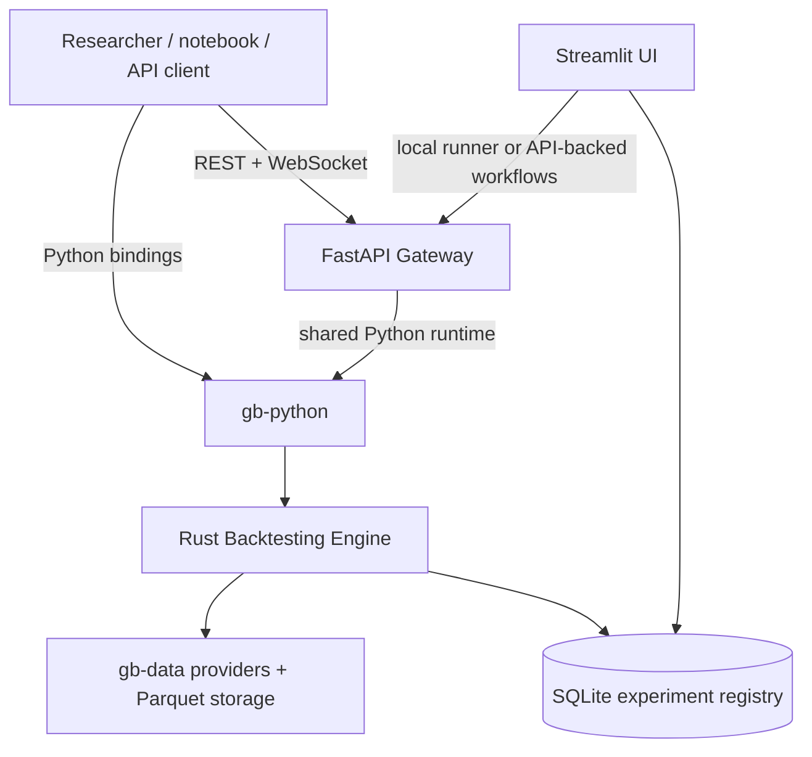

# Architecture

GlowBack is a Rust-first backtesting platform with Python bindings, a FastAPI gateway, and a local Streamlit research UI.

## Core Crates

- **gb-types**: core data structures, orders, portfolio accounting, metrics, and built-in strategies
- **gb-data**: data ingestion, providers, SQLite catalog metadata, and Parquet storage/loading
- **gb-engine**: event-driven backtesting engine, market simulation, execution settings, and run manifests
- **gb-python**: PyO3 bindings used by notebooks, the shared Python runtime, and the API gateway
- **gb-options**: options contracts, pricing, greeks, chain helpers, and execution primitives
- **gb-optimizer**: search-space and optimization primitives used by the API optimization workflow
- **gb-risk** / **gb-live**: early risk-monitoring and live/paper-trading surfaces that are still being hardened

## Data Flow (high level)

1. Load sample, CSV, or provider data through `gb-data` / `gb-python`.
2. Configure symbols, date range, strategy, execution costs, and optional data-quality mode.
3. Run the Rust engine directly from Rust, from Python bindings, or through the FastAPI gateway.
4. Persist completed runs, events, and saved UI strategies in the SQLite experiment registry.
5. Analyze results in notebooks, API clients, or the Streamlit UI.

## System Diagram

```mermaid
graph TD
    Researcher[Researcher / notebook / API client] -->|Python bindings| Py[gb-python]
    Researcher -->|REST + WebSocket| API[FastAPI Gateway]
    UI[Streamlit UI] -->|local runner or API-backed workflows| API
    API -->|shared Python runtime| Py
    Py --> Engine[Rust Backtesting Engine]
    Engine --> Data[gb-data providers + Parquet storage]
    Engine --> Registry[(SQLite experiment registry)]
    UI --> Registry
```

Notes:

- The current public API is REST + WebSocket; there is no gRPC gateway today.
- The maintained UI is Streamlit. References to a future React dashboard belong on the roadmap, not in the current architecture.
- Built-in strategies run through the Rust engine; custom Python strategies in the UI use the lighter local runner until that path is fully engine-backed.
